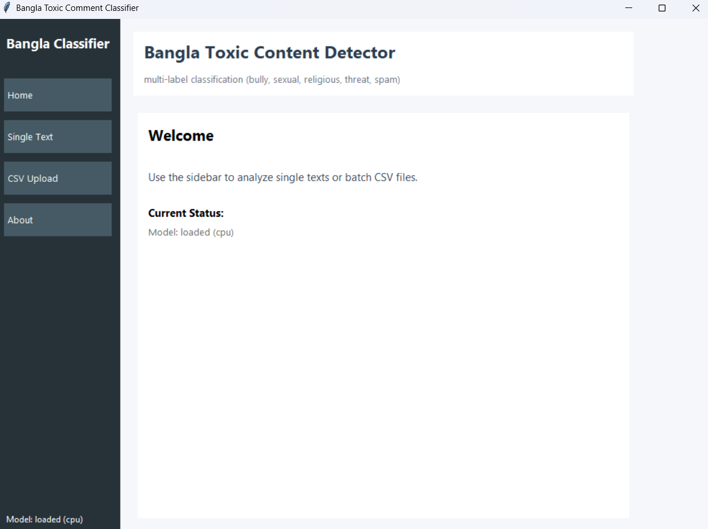
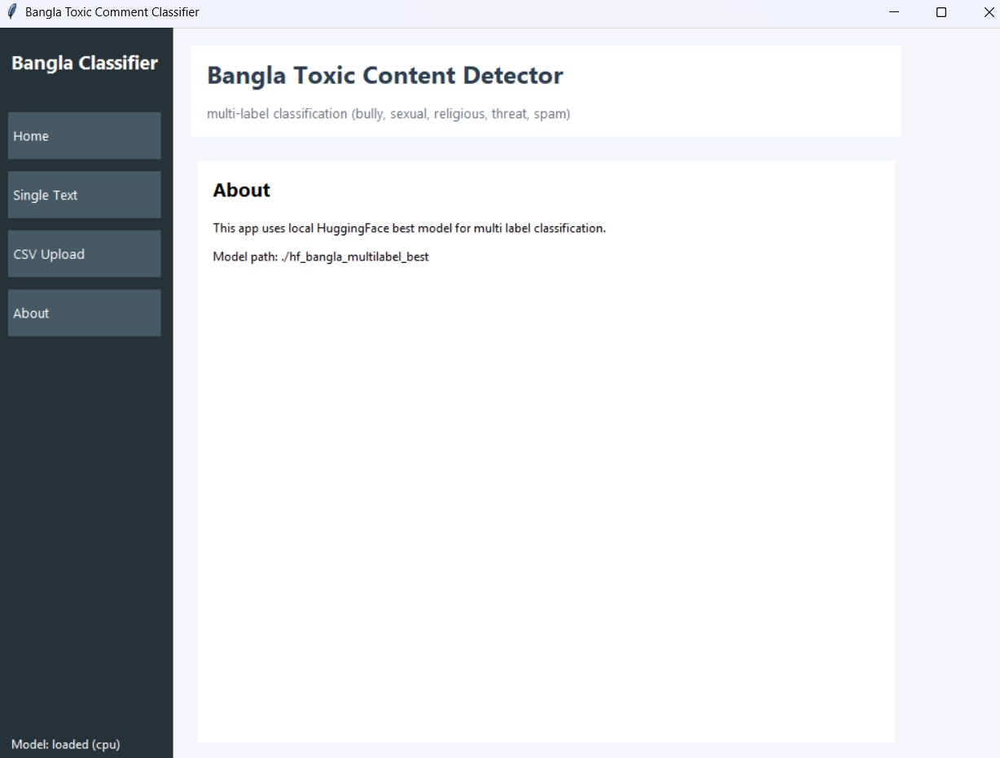
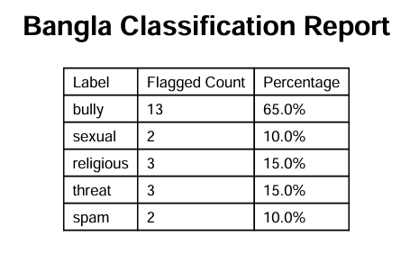

# 🇧🇩 Bangla Toxic Content Classifier

A **desktop based AI application** for detecting **toxic Bangla text** using a **multi label transformer model**. This project demonstrates **end to end Machine Learning deployment**, from model loading to a user friendly GUI with exportable reports.It's use cases Content moderation, social media analysis, Bangla NLP research, and educational machine learning projects.

## 🚀 Features

* ✅ Multi label toxic content detection
* 🏷️ Labels: **Bully, Sexual, Religious, Threat, Spam**
* 🖥️ Modern **Tkinter GUI**
* 📄 Analyze **single text** or **bulk CSV files**
* 📊 Confidence scores with threshold-based flagging
* 📤 Export results to **PDF, Excel, CSV, Image**
* ⚡ Offline inference
* 🧵 Background threading for smooth UI

## 🧠 Tech Stack

* **Python**
* **PyTorch**
* **HuggingFace Transformers**
* **Tkinter**
* **Pandas, Matplotlib**
* **ReportLab**

## 🖥️ Screenshots

<table>
  <tr>
    <th>Welcome </th>
    <th>Results 1</th>
    <th>Results 2</th>
  </tr>
  <tr>
    <td></td>
    <td></td>
    <td></td>
  </tr>
  <tr>
    <th>Results 3</th>
    <th>about</th>
    <th>Report</th>
  </tr>
  <tr>
    <td></td>
    <td></td>
    <td></td>
  </tr>
</table>

## 📁 Project Structure

```
Bangla-Toxic-Content-Classifier/
│
├── bangla_labeler_gui.py        # Main GUI application
├── hf_bangla_multilabel_best/   # Trained HuggingFace model (local)
│   ├── config.json
│   ├── pytorch_model.bin
│   └── tokenizer files
│
├── requirements.txt             # Python dependencies
├── screenshots/                 # GUI screenshots (optional)
├── sample_data/                 # Sample CSV/text files
└── README.md                    # Project documentation
```

## ⚙️ Installation & Setup

### 1️⃣ Clone the Repository

```bash
git clone https://github.com/tajulislamsaidul/Bangla-Toxic-Content-Classifier.git
cd Bangla-Toxic-Content-Classifier
```

### 2️⃣ Create Virtual Environment (Recommended)

```bash
python -m venv venv
source venv/bin/activate   # Linux/Mac
venv\\Scripts\\activate      # Windows
```

### 3️⃣ Install Dependencies

```bash
pip install -r requirements.txt
```

### 4️⃣ Run the Application

```bash
python bangla_labeler_gui.py
```

> ⚠️ Make sure the model folder `hf_bangla_multilabel_best` exists in the project root.

## 📊 CSV Format

Your CSV file must contain a column named:

```
text
```
Each row should contain one Bangla text sample.

## 📤 Export Options

* PDF classification report
* Excel (.xlsx) results
* CSV output
* Confidence score bar chart (PNG)

## 🎯 Use Cases

* Social media content moderation
* Bangla NLP research
* Hate speech detection
* Educational ML projects
* Offline AI tools

## 📌 Future Improvements

* Model retraining with larger datasets
* Web-based version (FastAPI / Streamlit)
* GPU performance optimization
* Additional toxicity categories


## 👨‍💻 Author

**Tajul Islm Saidul**
Machine Learning / NLP Engineer

📫 Feel free to connect on LinkedIn or open an issue for suggestions.

## ⭐ If you find this project useful

Give it a **star ⭐** and share your feedback


